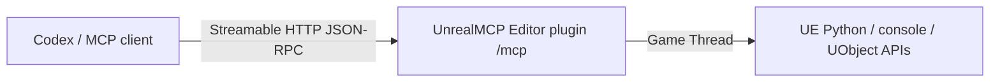

# UnrealMCP — native MCP for Unreal Engine 5.7

[English](README.md) | [简体中文](README.zh-CN.md)

UnrealMCP is a self-contained Unreal Engine 5.7 Editor Code Plugin. It embeds a Streamable HTTP MCP server in Unreal Editor, letting Codex and other local MCP clients inspect and control the open editor through exactly one MCP tool: `unreal`.

The shipped plugin does **not** require a gateway executable, Node.js, npm, a Python package, or a separately installed service. `Binaries/Win64/UnrealEditor-UnrealMCP.dll` owns the MCP endpoint and dispatches Unreal work to the Game Thread.

## Highlights

- **One-tool surface:** discovery, health checks, execution, and asynchronous task control all live behind `unreal`.
- **Direct Streamable HTTP:** MCP runs inside Unreal Editor at `http://127.0.0.1:18777/mcp` by default.
- **Agent-friendly:** ordered Python/console batches provide a flexible path to reflected UE APIs and project-specific systems such as UnLua.
- **Game Thread safe:** UObject and editor operations are dispatched onto the Unreal Game Thread.
- **Fab-oriented packaging:** release automation produces a clean, single-plugin ZIP with no external runtime.



## Status and compatibility

| Item | Current release |
|---|---|
| Plugin version | `0.3.1` |
| Engine | Unreal Engine `5.7` |
| Platform | `Win64` |
| Runtime target | Unreal Editor only |
| MCP surface | One tool: `unreal` |
| MCP negotiation | `server/discover` for `2026-07-28`; legacy `initialize` flows |
| External runtime dependencies | None |
| MCP endpoint | Streamable HTTP, `http://127.0.0.1:18777/mcp` by default |

The capability catalog covers every plugin group enabled by UE 5.8's official `AllToolsets` aggregate through UE 5.7 Python/reflection and console mechanisms. A subsystem that exists only in UE 5.8 cannot be created in stock UE 5.7; equivalent workflows work when the required 5.7 subsystem or optional plugin is available. See [capability coverage](docs/capability-coverage.md).

## Table of contents

- [Quick start](#quick-start)
- [Installation](#installation)
- [Connect Codex](#connect-codex)
- [Verify the first connection](#verify-the-first-connection)
- [The one-tool API](#the-one-tool-api)
- [Capability model](#capability-model)
- [Build from source](#build-from-source)
- [Test](#test)
- [Troubleshooting](#troubleshooting)
- [Security and operational limits](#security-and-operational-limits)
- [Repository map](#repository-map)
- [Distribution notes](#distribution-notes)

## Quick start

1. Download the named `UnrealMCP-...-GitHub.zip` asset from [GitHub Releases](https://github.com/AvatarGanymede/ue5.7-mcp/releases).
2. Close Unreal Editor, then extract the ZIP into the UE project root. This copies its `Plugins` directory next to the `.uproject` file.
3. Enable **Minimal MCP for Unreal Editor** and **Python Editor Script Plugin**, then restart Unreal Editor.
4. Add the Streamable HTTP URL to Codex.
5. Restart Codex, confirm `unreal` is connected with `/mcp`, and ask the agent to call the `health` action.

```toml
[mcp_servers.unreal]
url = "http://127.0.0.1:18777/mcp"
tool_timeout_sec = 3600
```

A healthy result includes `ok: true`, the actual engine version, `is_game_thread: true`, and `python_loaded: true`. Unreal Editor must remain open with the target project loaded.

## Installation

### Install from a GitHub Release (recommended)

Close Unreal Editor before copying or replacing binaries. Download the named `UnrealMCP-...-GitHub.zip` release asset, then extract it into the root of your UE project. Equivalently, copy the archive's `Plugins` directory into the project root and merge it with an existing `Plugins` directory.

```text
<Project>/
├─ <Project>.uproject
└─ Plugins/
   └─ UnrealMCP/
      ├─ UnrealMCP.uplugin
      └─ Binaries/Win64/UnrealEditor-UnrealMCP.dll
```

The descriptor must end up at `<Project>/Plugins/UnrealMCP/UnrealMCP.uplugin`. Open the project, enable **Minimal MCP for Unreal Editor** and **Python Editor Script Plugin** in **Edit → Plugins**, and restart the editor.

> [!IMPORTANT]
> Do not use GitHub's automatically generated **Source code (zip)** or **Source code (tar.gz)** archive as the installer. Those archives use the repository layout and are not validated as project-ready packages. Use the named release asset above, or build the plugin from source.

### Install from source

Clone the repository and create the same project-ready ZIP locally:

```powershell
git clone https://github.com/AvatarGanymede/ue5.7-mcp.git
cd ue5.7-mcp
.\scripts\build-github-package.ps1
```

Extract the generated `artifacts/UnrealMCP-...-GitHub.zip` into the UE project root. Building requires Unreal Engine 5.7 and its supported Visual Studio C++ toolchain.

### Engine installation

To make the plugin available to multiple projects using the same engine build, copy `Plugins/UnrealMCP` from the GitHub release archive to:

```text
C:/Program Files/Epic Games/UE_5.7/Engine/Plugins/Marketplace/UnrealMCP
```

Administrator permission may be required. A project-local installation is usually easier to version with the project and takes precedence for development.

## Connect Codex

Codex desktop, the Codex CLI, and the IDE extension share MCP configuration. Configuration can live globally at `~/.codex/config.toml`, or in `.codex/config.toml` inside a trusted project. Add the server from the command line:

```powershell
codex mcp add unreal --url http://127.0.0.1:18777/mcp
```

Or configure it directly:

```toml
[mcp_servers.unreal]
url = "http://127.0.0.1:18777/mcp"
tool_timeout_sec = 3600
```

You can also add the URL in Codex desktop under **Settings → MCP servers**. After saving the configuration, restart Codex and use `/mcp` to confirm that the server is connected.

The MCP server exists only while Unreal Editor is running with the plugin enabled. Open the target project before connecting or making a tool call.

### Port and authentication

The MCP server binds only to `127.0.0.1`. It reads these variables when Unreal Editor starts:

| Variable | Default | Purpose |
|---|---:|---|
| `UE_MCP_PORT` | `18777` | Streamable HTTP listener port. |
| `UE_MCP_TOKEN` | empty | Optional bearer token. |

For authentication, set the same token **before launching Unreal Editor and Codex**. Do not commit the token:

```powershell
$env:UE_MCP_TOKEN = '<a-long-random-token>'
$env:UE_MCP_PORT = '18777'
& 'C:\Program Files\Epic Games\UE_5.7\Engine\Binaries\Win64\UnrealEditor.exe' 'C:\path\Project.uproject'
```

Tell Codex which environment variable contains the bearer token:

```toml
[mcp_servers.unreal]
url = "http://127.0.0.1:18777/mcp"
bearer_token_env_var = "UE_MCP_TOKEN"
tool_timeout_sec = 3600
```

Set `UE_MCP_TOKEN` in the environment that launches Codex as well. Do not commit tokens to project configuration.

## Verify the first connection

Ask the MCP client to call `unreal` with:

```json
{
  "action": "health"
}
```

A healthy response has this shape:

```json
{
  "ok": true,
  "data": {
    "ok": true,
    "engine_version": "5.7.x-...",
    "is_game_thread": true,
    "python_loaded": true,
    "transport": "streamable-http",
    "endpoint": "http://127.0.0.1:18777/mcp"
  }
}
```

Then verify an engine read:

```json
{
  "action": "execute",
  "transaction": false,
  "commands": [
    {
      "kind": "python",
      "mode": "eval",
      "label": "engine-version",
      "code": "unreal.SystemLibrary.get_engine_version()"
    }
  ]
}
```

`eval` evaluates one Python expression and returns its value. `exec` executes statements or a multiline script. The `unreal` module is available in the plugin's Python execution environment.

## The one-tool API

`unreal` uses an action-discriminated schema so the MCP client receives only one tool definition while retaining discovery, execution, health checks, and long-running task control.

### Discover capabilities

Search the independent capability catalog before choosing UE APIs:

```json
{
  "action": "discover",
  "query": "create and compile a blueprint",
  "limit": 5
}
```

Use `domain` for an exact domain such as `blueprint`, `asset`, `niagara`, `pcg`, `slate`, `umg`, or `unlua`. Calling `discover` with no query returns catalog entries up to the requested limit.

### Execute an ordered batch

An `execute` batch accepts up to 100 Python or console commands. Commands run in order on the Game Thread.

```json
{
  "action": "execute",
  "run": "sync",
  "transaction": true,
  "continue_on_error": false,
  "commands": [
    {
      "kind": "python",
      "mode": "exec",
      "label": "select-all-static-mesh-actors",
      "code": "subsystem = unreal.get_editor_subsystem(unreal.EditorActorSubsystem)\nactors = subsystem.get_all_level_actors()\nsubsystem.set_selected_level_actors([a for a in actors if isinstance(a, unreal.StaticMeshActor)])"
    },
    {
      "kind": "console",
      "label": "show-fps",
      "command": "stat fps"
    }
  ]
}
```

- `transaction` defaults to `true` and creates one editor undo record when the whole batch succeeds.
- `continue_on_error` defaults to `false`; when enabled, later commands still run and the overall result remains unsuccessful if any command failed.
- Python results and captured Python logs, or console output, are returned per command.

Use `transaction: false` for read-only queries and APIs that do not participate in Unreal transactions. An Unreal transaction is an undo record, not a filesystem or source-control rollback.

### Run and inspect asynchronous work

For a long batch, submit it asynchronously:

```json
{
  "action": "execute",
  "run": "async",
  "commands": [
    {
      "kind": "console",
      "command": "Automation RunTests Project"
    }
  ]
}
```

The response contains a `task_id`. Poll or list tasks with:

```json
{ "action": "task", "command": "get", "task_id": "<uuid>" }
```

```json
{ "action": "task", "command": "list" }
```

Mark a task cancelled with:

```json
{ "action": "task", "command": "cancel", "task_id": "<uuid>" }
```

Task state is held in the Unreal Editor plugin and is lost when the editor stops or the module unloads. Cancellation is best-effort: it marks tracking as cancelled, but work already dispatched to the Unreal Game Thread may still complete and is not rolled back.

## Capability model

The plugin deliberately avoids hundreds of narrow wrapper tools. `discover` supplies recipes and preferred APIs; `execute` reaches UE 5.7's reflected Python surface, console commands, optional engine plugins, and project-specific APIs such as UnLua.

The catalog maps all 21 UE 5.8 `AllToolsets` groups, including editor/asset/Blueprint work, AI and navigation, animation, automation, configuration, conversations, Data Registry, Dataflow, Game Features, Gameplay Tags and GAS, Niagara, PCG, physics, plugins, semantic search, Slate, StateTree, UMG, and World Conditions.

Coverage is routing and mechanism coverage, not a claim that UE 5.8-only classes exist in UE 5.7. Optional workflows require their corresponding engine or project plugin to be enabled. The rationale and five minimization passes are documented in [tool minimization](docs/tool-minimization.md).

## Build from source

Requirements:

- Unreal Engine 5.7 source/build installation. The scripts default to `C:\Program Files\Epic Games\UE_5.7`.
- Visual Studio C++ toolchain supported by UE 5.7.
- PowerShell.
- Node.js 20+ only for optional metadata and client tests; Node is not a product runtime dependency.

Build a complete plugin package to a fresh directory:

```powershell
.\scripts\build-plugin.ps1 -OutputDirectory 'C:\Temp\UnrealMCP-Package'
```

Create a project-ready GitHub Release ZIP with the top-level `Plugins/UnrealMCP/` layout:

```powershell
.\scripts\build-github-package.ps1 -OutputFile '.\artifacts\UnrealMCP-0.3.1-UE5.7-Win64-GitHub.zip'
```

If `UnrealMCP/Binaries/Win64/UnrealEditor-UnrealMCP.dll` and `UnrealEditor.modules` were already built locally, package those prebuilt files without invoking Unreal Build Tool:

```powershell
.\scripts\package-prebuilt-github-release.ps1 -OutputFile '.\artifacts\UnrealMCP-0.3.1-UE5.7-Win64-GitHub.zip'
```

The tagged-release workflow uses this prebuilt path. It requires the descriptor, `package.json`, and `vMAJOR.MINOR.PATCH` tag versions to match, and fails when either required Win64 binary is absent from the tagged commit.

Create the single-top-level Fab ZIP:

```powershell
.\scripts\build-fab-package.ps1 -OutputFile '.\artifacts\UnrealMCP-0.3.1-UE5.7-Win64-Fab.zip'
```

Both packages contain the descriptor, source, config, resources, Editor DLL, license notices, English and Simplified Chinese READMEs, and design documents. The GitHub ZIP starts at `Plugins/UnrealMCP/` so it can be extracted directly into a project root. The Fab ZIP contains exactly one top-level `UnrealMCP/` directory for marketplace submission. Both exclude `Intermediate`, PDB files, EXEs, Node packages, and the development test project.

Each engine version and platform needs its own compiled and tested binary package. The current descriptor targets Win64 only.

## Test

Run the metadata and TypeScript checks:

```powershell
npm install
npm test
```

Run the full Streamable HTTP → in-editor MCP server → Game Thread → UE Python path:

```powershell
.\scripts\test-http-e2e.ps1
```

The end-to-end test builds a clean plugin package, generates a temporary host project, launches UE 5.7 headlessly on an isolated port, and shuts it down after verification. Close unrelated automated test instances if the chosen port is occupied.

## Troubleshooting

| Symptom | Likely cause and fix |
|---|---|
| MCP server fails to start | Check the Unreal Output Log for `LogUnrealMCP`, confirm the port is free, and verify the plugin is enabled. |
| `/mcp` shows the server but `health` cannot connect | Unreal Editor is not running, the plugin is disabled, or the configured URL/port differs from `UE_MCP_PORT`. |
| `unauthorized` | Codex's bearer token differs from the `UE_MCP_TOKEN` inherited by Unreal Editor. |
| `python_loaded` is `false` or Python commands fail | Enable **Python Editor Script Plugin**, restart the editor, and rerun `health`. |
| Port bind error in the Unreal Output Log | Another editor instance or process owns the port. Start this editor with a different `UE_MCP_PORT` and update the client URL. |
| A long call times out | Prefer `run: "async"` and ensure Codex `tool_timeout_sec` is long enough. |
| Plugin is reported incompatible | Use the UE 5.7 Win64 build or rebuild the plugin against the exact target engine/platform. Do not reuse binaries across engine versions. |
| A failed/cancelled call still changed assets | Some editor, filesystem, plugin, or config APIs are not transactional. Use previews, explicit saves, source control, and backups for destructive work. |
| An optional API/class is missing | Enable the corresponding UE 5.7 plugin and restart. UE 5.8-only APIs have no stock UE 5.7 implementation. |

Plugin startup, bind, authorization, protocol, and execution errors appear in the Unreal Output Log under `LogUnrealMCP`.

## Security and operational limits

`execute` intentionally permits arbitrary Unreal Python and console commands. Treat access to this tool as equivalent to allowing the agent to operate the open editor project.

- The MCP server binds only to loopback; it is not a remote network service.
- Bearer authentication is optional but recommended on shared machines.
- Request bodies are limited to 4 MiB and batches to 100 commands.
- UObject and editor access runs on the Game Thread.
- Do not place secrets in tool arguments, project files, logs, or committed Codex configuration.
- Use source control for destructive asset, config, plugin, and filesystem operations.

## Repository map

| Path | Purpose |
|---|---|
| `UnrealMCP/Source/UnrealMCP` | In-editor Streamable HTTP MCP server and execution module. |
| `UnrealMCP/Resources/UnrealMCP/metadata.json` | The one-tool schema and capability catalog. |
| `README.zh-CN.md` | Complete Simplified Chinese documentation. |
| `scripts/build-plugin.ps1` | Build a distributable UE plugin directory. |
| `scripts/build-github-package.ps1` | Build the project-ready GitHub Release ZIP. |
| `scripts/package-prebuilt-github-release.ps1` | Package locally built, tracked Win64 binaries without installing UE on the runner. |
| `scripts/build-fab-package.ps1` | Build and validate the Fab-oriented ZIP. |
| `scripts/test-http-e2e.ps1` | Run the real editor end-to-end test. |
| `.github/workflows/release.yml` | Package and publish a GitHub Release when a `vMAJOR.MINOR.PATCH` tag is pushed. |
| `tests/` | Metadata and optional Streamable HTTP client tests. |
| `docs/` | Architecture, capability, and minimization design notes. |

## Distribution notes

Publish the `...-GitHub.zip` package as a named GitHub Release asset for project installation; GitHub's automatic source archives are repository snapshots rather than validated project-ready packages. For automated releases, build `UnrealEditor-UnrealMCP.dll` and `UnrealEditor.modules` locally, include both files in the tagged commit, keep the tag version aligned with `UnrealMCP.uplugin` and `package.json`, and push a `vMAJOR.MINOR.PATCH` tag. The release workflow packages the tracked binaries on `windows-latest` and publishes the named ZIP without installing Unreal Engine. The separate `...-Fab.zip` package uses the single-plugin-root structure expected for Fab technical review. Marketplace publication still requires seller/listing metadata and visual assets such as the plugin icon and screenshots, plus a package tested for every advertised engine version and platform.

License details are in [LICENSE](LICENSE), and third-party notices are in [THIRD_PARTY_NOTICES.md](THIRD_PARTY_NOTICES.md). Additional design notes: [architecture](docs/architecture.md), [capability coverage](docs/capability-coverage.md), and [tool minimization](docs/tool-minimization.md).

If this project has helped you, please consider giving it a Star ⭐
