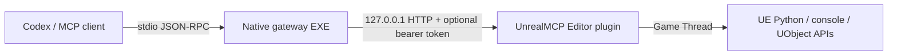

# UnrealMCP — native MCP for Unreal Engine 5.7

[English](README.md) | [简体中文](README.zh-CN.md)

UnrealMCP is a self-contained Unreal Engine 5.7 Editor Code Plugin. It lets Codex and other local MCP clients inspect and control an open Unreal Editor while exposing exactly one MCP tool: `unreal`.

The shipped plugin does **not** require Node.js, npm, a Python package, or a separately installed gateway service. It contains both runtime components:

- `Binaries/Win64/UnrealMCPGateway.exe` — native C++ stdio MCP server launched by the MCP client.
- `Binaries/Win64/UnrealEditor-UnrealMCP.dll` — Editor module that owns the loopback worker and dispatches Unreal work to the Game Thread.

## Highlights

- **One-tool surface:** discovery, health checks, execution, and asynchronous task control all live behind `unreal`.
- **Self-contained:** the distributable plugin includes the native stdio gateway and Unreal Editor worker.
- **Agent-friendly:** ordered Python/console batches provide a flexible path to reflected UE APIs and project-specific systems such as UnLua.
- **Game Thread safe:** UObject and editor operations are dispatched onto the Unreal Game Thread.
- **Fab-oriented packaging:** release automation produces a clean, single-plugin ZIP with no external runtime.



## Status and compatibility

| Item | Current release |
|---|---|
| Plugin version | `0.2.0` |
| Engine | Unreal Engine `5.7` |
| Platform | `Win64` |
| Runtime target | Unreal Editor only |
| MCP surface | One tool: `unreal` |
| MCP negotiation | `server/discover` for `2026-07-28`; legacy `initialize` flows |
| External runtime dependencies | None |
| Worker endpoint | Loopback only, `127.0.0.1:18777` by default |

The capability catalog covers every plugin group enabled by UE 5.8's official `AllToolsets` aggregate through UE 5.7 Python/reflection and console mechanisms. A subsystem that exists only in UE 5.8 cannot be created in stock UE 5.7; equivalent workflows work when the required 5.7 subsystem or optional plugin is available. See [capability coverage](docs/capability-coverage.md).

## Table of contents

- [Quick start](#quick-start)
- [Installation](#installation)
- [Connect Codex](#connect-codex)
- [Verify the first connection](#verify-the-first-connection)
- [The one-tool API](#the-one-tool-api)
- [Capability model](#capability-model)
- [Build from source](#build-from-source)
- [Test](#test)
- [Troubleshooting](#troubleshooting)
- [Security and operational limits](#security-and-operational-limits)
- [Repository map](#repository-map)
- [Distribution notes](#distribution-notes)

## Quick start

1. Extract the plugin so the descriptor is located at `<Project>/Plugins/UnrealMCP/UnrealMCP.uplugin` with no extra nested directory.
2. Enable **Minimal MCP for Unreal Editor** and **Python Editor Script Plugin**, then restart Unreal Editor.
3. Save the configuration below to the user-level `~/.codex/config.toml` or `.codex/config.toml` in a trusted project. Replace the command with the absolute gateway path.
4. Restart Codex, confirm `unreal` is connected with `/mcp`, and ask the agent to call the `health` action.

```toml
[mcp_servers.unreal]
command = "C:/absolute/project/path/Plugins/UnrealMCP/Binaries/Win64/UnrealMCPGateway.exe"
startup_timeout_sec = 15
tool_timeout_sec = 3600
```

A healthy result includes `ok: true`, the actual engine version, `is_game_thread: true`, and `python_loaded: true`. Unreal Editor must remain open with the target project loaded.

## Installation

### Project installation

Close Unreal Editor before copying or replacing binaries. Extract or copy the packaged `UnrealMCP` directory to:

```text
<Project>/Plugins/UnrealMCP
```

The descriptor must end up at:

```text
<Project>/Plugins/UnrealMCP/UnrealMCP.uplugin
```

Open the project, enable **Minimal MCP for Unreal Editor** and **Python Editor Script Plugin** in **Edit → Plugins**, and restart the editor.

### Engine installation

To make the plugin available to multiple projects using the same engine build, install it at:

```text
C:/Program Files/Epic Games/UE_5.7/Engine/Plugins/Marketplace/UnrealMCP
```

Administrator permission may be required. A project-local installation is usually easier to version with the project and takes precedence for development.

## Connect Codex

Codex desktop, the Codex CLI, and the IDE extension share MCP configuration. Local stdio servers are started from the configured `command`. Configuration can live globally at `~/.codex/config.toml`, or in `.codex/config.toml` inside a trusted project. See the [official Codex MCP documentation](https://learn.chatgpt.com/docs/extend/mcp?surface=cli).

Use forward slashes in a Windows TOML path:

```toml
[mcp_servers.unreal]
command = "C:/absolute/project/path/Plugins/UnrealMCP/Binaries/Win64/UnrealMCPGateway.exe"
startup_timeout_sec = 15
tool_timeout_sec = 3600
```

You can also add the server in Codex desktop under **Settings → MCP servers → Add → STDIO**. After saving the configuration, restart Codex and use `/mcp` to confirm that the server is connected.

The MCP client starts only the native gateway. It does not launch Unreal Editor. Open the target project in Unreal Editor before making a tool call.

### Port and authentication

The worker binds only to `127.0.0.1`. These environment variables are read independently by the editor and gateway:

| Variable | Default | Purpose |
|---|---:|---|
| `UE_MCP_WORKER_PORT` | `18777` | Loopback worker port; must match on both processes. |
| `UE_MCP_WORKER_TOKEN` | empty | Optional bearer token; must match on both processes. |
| `UE_MCP_TIMEOUT_MS` | `30000` | Gateway request timeout in milliseconds. |

For authentication, set the same token **before launching Unreal Editor and Codex**. Do not commit the token:

```powershell
$env:UE_MCP_WORKER_TOKEN = '<a-long-random-token>'
$env:UE_MCP_WORKER_PORT = '18777'
& 'C:\Program Files\Epic Games\UE_5.7\Engine\Binaries\Win64\UnrealEditor.exe' 'C:\path\Project.uproject'
```

If Codex is not launched from that shell, provide the same values to its MCP server configuration:

```toml
[mcp_servers.unreal]
command = "C:/absolute/project/path/Plugins/UnrealMCP/Binaries/Win64/UnrealMCPGateway.exe"
startup_timeout_sec = 15
tool_timeout_sec = 3600

[mcp_servers.unreal.env]
UE_MCP_WORKER_PORT = "18777"
UE_MCP_WORKER_TOKEN = "replace-with-the-same-token-used-by-the-editor"
UE_MCP_TIMEOUT_MS = "30000"
```

## Verify the first connection

Ask the MCP client to call `unreal` with:

```json
{
  "action": "health"
}
```

A healthy response has this shape:

```json
{
  "ok": true,
  "data": {
    "ok": true,
    "engine_version": "5.7.x-...",
    "is_game_thread": true,
    "python_loaded": true,
    "transport": "loopback-http"
  }
}
```

Then verify an engine read:

```json
{
  "action": "execute",
  "transaction": false,
  "commands": [
    {
      "kind": "python",
      "mode": "eval",
      "label": "engine-version",
      "code": "unreal.SystemLibrary.get_engine_version()"
    }
  ]
}
```

`eval` evaluates one Python expression and returns its value. `exec` executes statements or a multiline script. The `unreal` module is available in the plugin's Python execution environment.

## The one-tool API

`unreal` uses an action-discriminated schema so the MCP client receives only one tool definition while retaining discovery, execution, health checks, and long-running task control.

### Discover capabilities

Search the independent capability catalog before choosing UE APIs:

```json
{
  "action": "discover",
  "query": "create and compile a blueprint",
  "limit": 5
}
```

Use `domain` for an exact domain such as `blueprint`, `asset`, `niagara`, `pcg`, `slate`, `umg`, or `unlua`. Calling `discover` with no query returns catalog entries up to the requested limit.

### Execute an ordered batch

An `execute` batch accepts up to 100 Python or console commands. Commands run in order on the Game Thread.

```json
{
  "action": "execute",
  "run": "sync",
  "transaction": true,
  "continue_on_error": false,
  "timeout_ms": 120000,
  "commands": [
    {
      "kind": "python",
      "mode": "exec",
      "label": "select-all-static-mesh-actors",
      "code": "subsystem = unreal.get_editor_subsystem(unreal.EditorActorSubsystem)\nactors = subsystem.get_all_level_actors()\nsubsystem.set_selected_level_actors([a for a in actors if isinstance(a, unreal.StaticMeshActor)])"
    },
    {
      "kind": "console",
      "label": "show-fps",
      "command": "stat fps"
    }
  ]
}
```

- `transaction` defaults to `true` and creates one editor undo record when the whole batch succeeds.
- `continue_on_error` defaults to `false`; when enabled, later commands still run and the overall result remains unsuccessful if any command failed.
- `timeout_ms` accepts `100` through `3600000` milliseconds and overrides `UE_MCP_TIMEOUT_MS` for that call.
- Python results and captured Python logs, or console output, are returned per command.

Use `transaction: false` for read-only queries and APIs that do not participate in Unreal transactions. An Unreal transaction is an undo record, not a filesystem or source-control rollback.

### Run and inspect asynchronous work

For a long batch, submit it asynchronously:

```json
{
  "action": "execute",
  "run": "async",
  "timeout_ms": 3600000,
  "commands": [
    {
      "kind": "console",
      "command": "Automation RunTests Project"
    }
  ]
}
```

The response contains a `task_id`. Poll or list tasks with:

```json
{ "action": "task", "command": "get", "task_id": "<uuid>" }
```

```json
{ "action": "task", "command": "list" }
```

Mark a task cancelled with:

```json
{ "action": "task", "command": "cancel", "task_id": "<uuid>" }
```

Task state is held in the gateway process and is lost when Codex stops that process. Cancellation is best-effort: it marks tracking as cancelled, but work already dispatched to the Unreal Game Thread may still complete and is not rolled back.

## Capability model

The plugin deliberately avoids hundreds of narrow wrapper tools. `discover` supplies recipes and preferred APIs; `execute` reaches UE 5.7's reflected Python surface, console commands, optional engine plugins, and project-specific APIs such as UnLua.

The catalog maps all 21 UE 5.8 `AllToolsets` groups, including editor/asset/Blueprint work, AI and navigation, animation, automation, configuration, conversations, Data Registry, Dataflow, Game Features, Gameplay Tags and GAS, Niagara, PCG, physics, plugins, semantic search, Slate, StateTree, UMG, and World Conditions.

Coverage is routing and mechanism coverage, not a claim that UE 5.8-only classes exist in UE 5.7. Optional workflows require their corresponding engine or project plugin to be enabled. The rationale and five minimization passes are documented in [tool minimization](docs/tool-minimization.md).

## Build from source

Requirements:

- Unreal Engine 5.7 source/build installation. The scripts default to `C:\Program Files\Epic Games\UE_5.7`.
- Visual Studio C++ toolchain supported by UE 5.7.
- PowerShell.
- Node.js 20+ only for the optional MCP protocol tests; Node is not a product runtime dependency.

Compile the native gateway in place:

```powershell
.\scripts\build-native-gateway.ps1
```

Build a complete plugin package to a fresh directory:

```powershell
.\scripts\build-plugin.ps1 -OutputDirectory 'C:\Temp\UnrealMCP-Package'
```

Create the single-top-level Fab ZIP:

```powershell
.\scripts\build-fab-package.ps1 -OutputFile '.\artifacts\UnrealMCP-0.2.0-UE5.7-Win64.zip'
```

The packaged plugin contains the descriptor, source, config, resources, native DLL and EXE, license notices, English and Simplified Chinese READMEs, and design documents. The Fab ZIP contains exactly one top-level `UnrealMCP/` directory and excludes `Intermediate`, PDB files, Node packages, and the development test project.

Each engine version and platform needs its own compiled and tested binary package. The current descriptor targets Win64 only.

## Test

Run the metadata and native modern/legacy MCP integration tests:

```powershell
npm install
npm test
```

Run the full native stdio gateway → loopback worker → Game Thread → UE Python path:

```powershell
.\scripts\build-native-gateway.ps1
.\scripts\test-worker-e2e.ps1
```

The end-to-end test launches the included `UE57MCPTest.uproject` headlessly on an isolated port and shuts it down after verification. Close unrelated automated test instances if the chosen port is occupied.

## Troubleshooting

| Symptom | Likely cause and fix |
|---|---|
| MCP server fails to start | Confirm the configured path points directly to `UnrealMCPGateway.exe`, uses an absolute path, and the file is not blocked or quarantined. Restart Codex after changing configuration. |
| `/mcp` shows the server but `health` cannot connect | Unreal Editor is not running, the plugin is disabled, or editor and gateway ports differ. Open the target project and check `UE_MCP_WORKER_PORT`. |
| `unauthorized` | `UE_MCP_WORKER_TOKEN` differs between the editor and gateway. Both processes must inherit the same value from startup. |
| `python_loaded` is `false` or Python commands fail | Enable **Python Editor Script Plugin**, restart the editor, and rerun `health`. |
| Port bind error in the Unreal Output Log | Another editor instance or process owns the port. Give both this editor and its gateway the same unused `UE_MCP_WORKER_PORT`. |
| A long call times out | Prefer `run: "async"`, raise the per-call `timeout_ms`, and ensure Codex `tool_timeout_sec` is long enough. |
| Plugin is reported incompatible | Use the UE 5.7 Win64 build or rebuild the plugin against the exact target engine/platform. Do not reuse binaries across engine versions. |
| A failed/cancelled call still changed assets | Some editor, filesystem, plugin, or config APIs are not transactional. Use previews, explicit saves, source control, and backups for destructive work. |
| An optional API/class is missing | Enable the corresponding UE 5.7 plugin and restart. UE 5.8-only APIs have no stock UE 5.7 implementation. |

The gateway writes MCP protocol messages only to stdout and diagnostics to stderr. Plugin startup, bind, authorization, and execution errors appear in the Unreal Output Log under `LogUnrealMCP`.

## Security and operational limits

`execute` intentionally permits arbitrary Unreal Python and console commands. Treat access to this tool as equivalent to allowing the agent to operate the open editor project.

- The worker binds only to loopback; it is not a remote network service.
- Bearer authentication is optional but recommended on shared machines.
- Request bodies are limited to 4 MiB and batches to 100 commands.
- UObject and editor access runs on the Game Thread.
- Do not place secrets in tool arguments, project files, logs, or committed Codex configuration.
- Use source control for destructive asset, config, plugin, and filesystem operations.

## Repository map

| Path | Purpose |
|---|---|
| `UnrealMCP/Source/UnrealMCP` | Unreal Editor worker module. |
| `UnrealMCP/Source/Programs/UnrealMCPGateway` | Native stdio MCP gateway. |
| `UnrealMCP/Resources/UnrealMCP/metadata.json` | The one-tool schema and capability catalog. |
| `README.zh-CN.md` | Complete Simplified Chinese documentation. |
| `scripts/build-native-gateway.ps1` | Build the standalone gateway. |
| `scripts/build-plugin.ps1` | Build a distributable UE plugin directory. |
| `scripts/build-fab-package.ps1` | Build and validate the Fab-oriented ZIP. |
| `scripts/test-worker-e2e.ps1` | Run the real editor end-to-end test. |
| `tests/` | Metadata and native protocol tests. |
| `docs/` | Architecture, capability, and minimization design notes. |

## Distribution notes

The generated ZIP is structured as a single installable UE Code Plugin suitable for Fab technical review. Marketplace publication still requires seller/listing metadata and visual assets such as the plugin icon and screenshots, plus a package tested for every advertised engine version and platform.

License details are in [LICENSE](LICENSE), and third-party notices are in [THIRD_PARTY_NOTICES.md](THIRD_PARTY_NOTICES.md). Additional design notes: [architecture](docs/architecture.md), [capability coverage](docs/capability-coverage.md), and [tool minimization](docs/tool-minimization.md).

If this project has helped you, please consider giving it a Star ⭐
