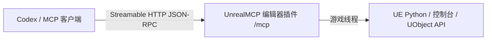

# UnrealMCP — 面向 Unreal Engine 5.7 的原生 MCP 插件

[English](README.md) | [简体中文](README.zh-CN.md)

UnrealMCP 是一个自包含的 Unreal Engine 5.7 编辑器代码插件。它把 Streamable HTTP MCP 服务直接嵌入 Unreal Editor，让 Codex 和其他本地 MCP 客户端能够检查并控制已打开的编辑器，同时只向 Agent 暴露一个 MCP 工具：`unreal`。

发布版插件**不需要**网关 EXE、Node.js、npm、Python 第三方包或单独安装的服务。`Binaries/Win64/UnrealEditor-UnrealMCP.dll` 直接提供 MCP 端点，并将 Unreal 操作调度到游戏线程。

## 主要特点

- **单工具接口：** 发现能力、健康检查、执行命令和异步任务控制均通过 `unreal` 完成。
- **直接 Streamable HTTP：** MCP 默认在 Unreal Editor 内通过 `http://127.0.0.1:18777/mcp` 提供服务。
- **适合 Agent：** 有序 Python/控制台批处理可灵活访问 UE 反射 API 以及 UnLua 等项目专用系统。
- **游戏线程安全：** UObject 和编辑器操作会被调度到 Unreal 游戏线程。
- **面向 Fab 打包：** 发布脚本生成不依赖外部运行时的单插件整洁 ZIP。



## 状态与兼容性

| 项目 | 当前版本 |
|---|---|
| 插件版本 | `0.3.1` |
| 引擎 | Unreal Engine `5.7` |
| 平台 | `Win64` |
| 运行目标 | 仅 Unreal Editor |
| MCP 接口 | 一个工具：`unreal` |
| MCP 协商 | `2026-07-28` 的 `server/discover`；兼容旧版 `initialize` 流程 |
| 外部运行时依赖 | 无 |
| MCP 端点 | Streamable HTTP，默认 `http://127.0.0.1:18777/mcp` |

能力目录通过 UE 5.7 的 Python/反射和控制台机制覆盖 UE 5.8 官方 `AllToolsets` 聚合插件启用的所有插件组。UE 5.8 独有子系统无法凭空出现在原生 UE 5.7 中；如果 UE 5.7 存在相应子系统或可选插件，则可以实现等价工作流。详见[能力覆盖说明](docs/capability-coverage.md)。

## 目录

- [快速开始](#快速开始)
- [安装](#安装)
- [连接 Codex](#连接-codex)
- [验证首次连接](#验证首次连接)
- [单工具 API](#单工具-api)
- [能力模型](#能力模型)
- [从源码构建](#从源码构建)
- [测试](#测试)
- [故障排查](#故障排查)
- [安全与运行限制](#安全与运行限制)
- [仓库结构](#仓库结构)
- [发布说明](#发布说明)

## 快速开始

1. 从 [GitHub Releases](https://github.com/AvatarGanymede/ue5.7-mcp/releases) 下载命名为 `UnrealMCP-...-GitHub.zip` 的发布附件。
2. 关闭 Unreal Editor，将 ZIP 解压到 UE 工程根目录，也就是把其中的 `Plugins` 目录复制到 `.uproject` 文件旁边。
3. 启用 **Minimal MCP for Unreal Editor** 和 **Python Editor Script Plugin**，然后重启 Unreal Editor。
4. 将 Streamable HTTP URL 添加到 Codex。
5. 重启 Codex，使用 `/mcp` 确认 `unreal` 已连接，然后让 Agent 调用 `health` 动作。

```toml
[mcp_servers.unreal]
url = "http://127.0.0.1:18777/mcp"
tool_timeout_sec = 3600
```

正常结果应包含 `ok: true`、实际引擎版本、`is_game_thread: true` 和 `python_loaded: true`。Unreal Editor 必须保持运行并已打开目标项目。

## 安装

### 从 GitHub Release 安装（推荐）

复制或替换二进制文件前，请先关闭 Unreal Editor。下载命名为 `UnrealMCP-...-GitHub.zip` 的发布附件，然后直接解压到 UE 工程根目录；也可以将压缩包中的 `Plugins` 目录复制到工程根目录，如果已有同名目录则合并。

```text
<Project>/
├─ <Project>.uproject
└─ Plugins/
   └─ UnrealMCP/
      ├─ UnrealMCP.uplugin
      └─ Binaries/Win64/UnrealEditor-UnrealMCP.dll
```

最终描述文件必须位于 `<Project>/Plugins/UnrealMCP/UnrealMCP.uplugin`。打开项目，在 **编辑 → 插件** 中启用 **Minimal MCP for Unreal Editor** 和 **Python Editor Script Plugin**，然后重启编辑器。

> [!IMPORTANT]
> 不要把 GitHub 自动生成的 **Source code (zip)** 或 **Source code (tar.gz)** 当成安装包使用。这两个压缩包采用仓库目录结构，并不是经过校验、可直接安装到工程的插件包。普通用户应下载上面的命名发布附件；开发者也可以自行从源码构建。

### 从源码安装

克隆仓库，并在本机生成同样的工程安装包：

```powershell
git clone https://github.com/AvatarGanymede/ue5.7-mcp.git
cd ue5.7-mcp
.\scripts\build-github-package.ps1
```

将生成的 `artifacts/UnrealMCP-...-GitHub.zip` 解压到 UE 工程根目录。源码构建需要 Unreal Engine 5.7 以及该版本支持的 Visual Studio C++ 工具链。

### 安装到引擎

如需让同一引擎版本下的多个项目都能使用该插件，可将 GitHub 发布包中的 `Plugins/UnrealMCP` 复制到：

```text
C:/Program Files/Epic Games/UE_5.7/Engine/Plugins/Marketplace/UnrealMCP
```

此位置可能需要管理员权限。项目级安装通常更易于随项目进行版本管理，也更适合插件开发。

## 连接 Codex

Codex 桌面版、Codex CLI 和 IDE 扩展共享 MCP 配置。配置可以全局保存在 `~/.codex/config.toml`，也可以保存在受信任项目内的 `.codex/config.toml`。可通过命令行添加：

```powershell
codex mcp add unreal --url http://127.0.0.1:18777/mcp
```

也可以直接编辑配置：

```toml
[mcp_servers.unreal]
url = "http://127.0.0.1:18777/mcp"
tool_timeout_sec = 3600
```

也可以在 Codex 桌面版的 **Settings → MCP servers** 中添加该 URL。保存配置后重启 Codex，并使用 `/mcp` 确认服务已连接。

MCP 服务只在启用了插件的 Unreal Editor 运行期间存在。连接或调用工具前，请先打开目标项目。

### 端口与认证

MCP 服务只绑定到 `127.0.0.1`，并在 Unreal Editor 启动时读取以下环境变量：

| 变量 | 默认值 | 用途 |
|---|---:|---|
| `UE_MCP_PORT` | `18777` | Streamable HTTP 监听端口。 |
| `UE_MCP_TOKEN` | 空 | 可选 Bearer Token。 |

如需启用认证，请在启动 Unreal Editor 和 Codex **之前**设置相同 Token。不要把 Token 提交到仓库：

```powershell
$env:UE_MCP_TOKEN = '<a-long-random-token>'
$env:UE_MCP_PORT = '18777'
& 'C:\Program Files\Epic Games\UE_5.7\Engine\Binaries\Win64\UnrealEditor.exe' 'C:\path\Project.uproject'
```

告诉 Codex 从哪个环境变量读取 Bearer Token：

```toml
[mcp_servers.unreal]
url = "http://127.0.0.1:18777/mcp"
bearer_token_env_var = "UE_MCP_TOKEN"
tool_timeout_sec = 3600
```

启动 Codex 的环境中也必须设置 `UE_MCP_TOKEN`。不要将 Token 提交到项目配置。

## 验证首次连接

让 MCP 客户端调用 `unreal`：

```json
{
  "action": "health"
}
```

健康响应的结构如下：

```json
{
  "ok": true,
  "data": {
    "ok": true,
    "engine_version": "5.7.x-...",
    "is_game_thread": true,
    "python_loaded": true,
    "transport": "streamable-http",
    "endpoint": "http://127.0.0.1:18777/mcp"
  }
}
```

然后验证一次引擎读取：

```json
{
  "action": "execute",
  "transaction": false,
  "commands": [
    {
      "kind": "python",
      "mode": "eval",
      "label": "engine-version",
      "code": "unreal.SystemLibrary.get_engine_version()"
    }
  ]
}
```

`eval` 用于计算单个 Python 表达式并返回值；`exec` 用于执行语句或多行脚本。插件的 Python 执行环境中可以直接使用 `unreal` 模块。

## 单工具 API

`unreal` 使用按动作区分的 Schema，让 MCP 客户端只接收一个工具定义，同时保留能力发现、执行、健康检查和长任务控制。

### 发现能力

选择 UE API 前，可以搜索独立能力目录：

```json
{
  "action": "discover",
  "query": "create and compile a blueprint",
  "limit": 5
}
```

使用 `domain` 可以精确选择 `blueprint`、`asset`、`niagara`、`pcg`、`slate`、`umg` 或 `unlua` 等能力域。不提供查询词时，`discover` 会按指定数量返回目录条目。

### 执行有序批处理

一次 `execute` 最多接受 100 条 Python 或控制台命令，并在游戏线程中按顺序执行。

```json
{
  "action": "execute",
  "run": "sync",
  "transaction": true,
  "continue_on_error": false,
  "commands": [
    {
      "kind": "python",
      "mode": "exec",
      "label": "select-all-static-mesh-actors",
      "code": "subsystem = unreal.get_editor_subsystem(unreal.EditorActorSubsystem)\nactors = subsystem.get_all_level_actors()\nsubsystem.set_selected_level_actors([a for a in actors if isinstance(a, unreal.StaticMeshActor)])"
    },
    {
      "kind": "console",
      "label": "show-fps",
      "command": "stat fps"
    }
  ]
}
```

- `transaction` 默认为 `true`；整个批次成功时创建一条编辑器撤销记录。
- `continue_on_error` 默认为 `false`；启用后即使某条命令失败，后续命令仍会执行，但整体结果仍标记为失败。
- 每条命令都会返回 Python 结果和捕获的 Python 日志，或控制台输出。

只读查询以及不参与 Unreal 事务的 API 应使用 `transaction: false`。Unreal 事务只是撤销记录，并不是文件系统或源代码管理回滚。

### 运行与检查异步任务

长批次可以异步提交：

```json
{
  "action": "execute",
  "run": "async",
  "commands": [
    {
      "kind": "console",
      "command": "Automation RunTests Project"
    }
  ]
}
```

响应中会包含 `task_id`。可以轮询或列出任务：

```json
{ "action": "task", "command": "get", "task_id": "<uuid>" }
```

```json
{ "action": "task", "command": "list" }
```

将任务标记为取消：

```json
{ "action": "task", "command": "cancel", "task_id": "<uuid>" }
```

任务状态保存在 Unreal Editor 插件内；编辑器停止或模块卸载后状态会丢失。取消是尽力而为：它会把跟踪状态标记为已取消，但已经提交到 Unreal 游戏线程的工作仍可能完成，而且不会自动回滚。

## 能力模型

插件刻意避免暴露数百个狭窄的包装工具。`discover` 提供能力配方和推荐 API；`execute` 可访问 UE 5.7 的反射 Python 接口、控制台命令、可选引擎插件，以及 UnLua 等项目专用 API。

能力目录映射了 UE 5.8 `AllToolsets` 的全部 21 个插件组，包括编辑器/资产/蓝图、AI 与导航、动画、自动化、配置、Conversation、Data Registry、Dataflow、Game Features、Gameplay Tags 与 GAS、Niagara、PCG、物理、插件、语义搜索、Slate、StateTree、UMG 和 World Conditions。

这里的覆盖指路由与机制覆盖，并不声称 UE 5.8 独有类存在于 UE 5.7 中。可选工作流要求启用相应引擎或项目插件。设计理由和五轮工具精简过程记录在[工具精简说明](docs/tool-minimization.md)中。

## 从源码构建

要求：

- Unreal Engine 5.7 源码/构建安装。脚本默认路径为 `C:\Program Files\Epic Games\UE_5.7`。
- UE 5.7 支持的 Visual Studio C++ 工具链。
- PowerShell。
- Node.js 20+ 仅用于可选元数据和客户端测试，不是产品运行时依赖。

将完整插件构建到一个全新目录：

```powershell
.\scripts\build-plugin.ps1 -OutputDirectory 'C:\Temp\UnrealMCP-Package'
```

创建顶层结构为 `Plugins/UnrealMCP/`、可直接解压到工程根目录的 GitHub Release ZIP：

```powershell
.\scripts\build-github-package.ps1 -OutputFile '.\artifacts\UnrealMCP-0.3.1-UE5.7-Win64-GitHub.zip'
```

如果已经在本地构建好 `UnrealMCP/Binaries/Win64/UnrealEditor-UnrealMCP.dll` 和 `UnrealEditor.modules`，可直接打包这些预编译文件，而不调用 Unreal Build Tool：

```powershell
.\scripts\package-prebuilt-github-release.ps1 -OutputFile '.\artifacts\UnrealMCP-0.3.1-UE5.7-Win64-GitHub.zip'
```

版本标签发布 Workflow 使用这条预编译打包路径。它要求描述文件、`package.json` 和 `vMAJOR.MINOR.PATCH` 标签的版本一致；如果标签对应的提交缺少任一 Win64 必需二进制文件，发布会失败。如果 Release 已经存在，可以手动运行 Workflow，选择相应标签重新打包并上传或替换命名 ZIP，而不会再次创建同名 Release。

创建只有一个顶层目录的 Fab ZIP：

```powershell
.\scripts\build-fab-package.ps1 -OutputFile '.\artifacts\UnrealMCP-0.3.1-UE5.7-Win64-Fab.zip'
```

两个安装包都包含描述文件、源码、配置、资源、Editor DLL、许可证说明、中英文 README 以及设计文档。GitHub ZIP 从 `Plugins/UnrealMCP/` 开始，可以直接解压到工程根目录；Fab ZIP 只有一个顶层 `UnrealMCP/` 目录，用于商城提交。两者都排除 `Intermediate`、PDB、EXE、Node 包和开发测试项目。

每个引擎版本和平台都需要单独编译并测试二进制包。当前描述文件仅支持 Win64。

## 测试

运行元数据和 TypeScript 检查：

```powershell
npm install
npm test
```

运行 Streamable HTTP → Editor 内 MCP 服务 → 游戏线程 → UE Python 完整链路：

```powershell
.\scripts\test-http-e2e.ps1
```

端到端测试会先构建干净的插件包、生成临时宿主项目，再使用隔离端口无界面启动 UE 5.7，并在验证完成后自动关闭。如果所选端口被占用，请先关闭无关的自动化测试实例。

## 故障排查

| 现象 | 可能原因与处理方式 |
|---|---|
| MCP 服务启动失败 | 在 Unreal Output Log 中检查 `LogUnrealMCP`，确认端口未占用且插件已启用。 |
| `/mcp` 显示服务，但 `health` 无法连接 | Unreal Editor 未运行、插件未启用，或配置 URL 的端口与 `UE_MCP_PORT` 不一致。 |
| 返回 `unauthorized` | Codex 的 Bearer Token 与 Unreal Editor 继承的 `UE_MCP_TOKEN` 不一致。 |
| `python_loaded` 为 `false` 或 Python 命令失败 | 启用 **Python Editor Script Plugin**，重启编辑器并重新调用 `health`。 |
| Unreal Output Log 出现端口绑定错误 | 其他编辑器实例或进程占用了端口。使用其他 `UE_MCP_PORT` 启动编辑器并同步更新客户端 URL。 |
| 长调用超时 | 优先使用 `run: "async"`，并确保 Codex 的 `tool_timeout_sec` 足够长。 |
| 插件被报告为不兼容 | 使用 UE 5.7 Win64 构建，或针对目标引擎和平台重新构建。不要跨引擎版本复用二进制文件。 |
| 失败或取消后资产仍发生变化 | 部分编辑器、文件系统、插件或配置 API 不参与事务。破坏性操作应使用预览、显式保存、源代码管理和备份。 |
| 缺少可选 API 或类 | 启用相应 UE 5.7 插件并重启。UE 5.8 独有 API 在原生 UE 5.7 中不存在。 |

插件启动、端口绑定、认证、协议和执行错误会显示在 Unreal Output Log 的 `LogUnrealMCP` 类别中。

## 安全与运行限制

`execute` 有意允许执行任意 Unreal Python 和控制台命令。应当把该工具的访问权限视为允许 Agent 操作当前打开的编辑器项目。

- MCP 服务只绑定本机回环，不是远程网络服务。
- Bearer 认证为可选功能，但共享计算机上建议启用。
- 请求体最大 4 MiB，每批最多 100 条命令。
- UObject 和编辑器访问在游戏线程中执行。
- 不要在工具参数、项目文件、日志或已提交的 Codex 配置中保存密钥。
- 破坏性的资产、配置、插件和文件系统操作应使用源代码管理。

## 仓库结构

| 路径 | 用途 |
|---|---|
| `UnrealMCP/Source/UnrealMCP` | Editor 内 Streamable HTTP MCP 服务与执行模块。 |
| `UnrealMCP/Resources/UnrealMCP/metadata.json` | 单工具 Schema 和能力目录。 |
| `scripts/build-plugin.ps1` | 构建可发布的 UE 插件目录。 |
| `scripts/build-github-package.ps1` | 构建可直接安装到项目的 GitHub Release ZIP。 |
| `scripts/package-prebuilt-github-release.ps1` | 无需在 runner 安装 UE，直接打包本地构建并纳入版本控制的 Win64 二进制。 |
| `scripts/build-fab-package.ps1` | 构建并校验面向 Fab 的 ZIP。 |
| `scripts/test-http-e2e.ps1` | 运行真实编辑器端到端测试。 |
| `.github/workflows/release.yml` | 推送 `vMAJOR.MINOR.PATCH` 标签时打包并发布 GitHub Release。 |
| `tests/` | 元数据和可选 Streamable HTTP 客户端测试。 |
| `docs/` | 架构、能力覆盖和工具精简设计说明。 |

## 发布说明

应将 `...-GitHub.zip` 作为命名附件上传到 GitHub Release，供用户安装到工程；GitHub 自动生成的源码压缩包是仓库快照，不是经过校验、可直接安装到工程的插件包。自动发布时，先在本地构建 `UnrealEditor-UnrealMCP.dll` 和 `UnrealEditor.modules`，将两者纳入标签对应的提交，保持标签版本与 `UnrealMCP.uplugin`、`package.json` 一致，然后推送 `vMAJOR.MINOR.PATCH` 标签。发布 Workflow 会在 `windows-latest` 上打包已跟踪的二进制并发布命名 ZIP，不需要安装 Unreal Engine。对于已经存在的 Release，可以安全地重新运行 Workflow；它只替换同名 ZIP 附件。另行生成的 `...-Fab.zip` 使用 Fab 技术审核所需的单插件根目录结构。正式上架仍需要卖家与商品页元数据、插件图标和截图等视觉素材，并为所有声明支持的引擎版本和平台分别提供经过测试的软件包。

许可证详见 [LICENSE](LICENSE)，第三方声明详见 [THIRD_PARTY_NOTICES.md](THIRD_PARTY_NOTICES.md)。其他设计文档：[架构](docs/architecture.md)、[能力覆盖](docs/capability-coverage.md)和[工具精简](docs/tool-minimization.md)。

如果这个项目帮助到了你，欢迎给它一个 Star ⭐
