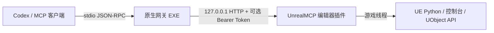

# UnrealMCP — 面向 Unreal Engine 5.7 的原生 MCP 插件

[English](README.md) | [简体中文](README.zh-CN.md)

UnrealMCP 是一个自包含的 Unreal Engine 5.7 编辑器代码插件。它让 Codex 和其他本地 MCP 客户端能够检查并控制已打开的 Unreal Editor，同时只向 Agent 暴露一个 MCP 工具：`unreal`。

发布版插件**不需要** Node.js、npm、Python 第三方包或单独安装的网关服务。两个运行时组件都包含在插件内：

- `Binaries/Win64/UnrealMCPGateway.exe` — 由 MCP 客户端启动的原生 C++ stdio MCP 服务。
- `Binaries/Win64/UnrealEditor-UnrealMCP.dll` — 提供本机回环 Worker，并将 Unreal 操作调度到游戏线程的编辑器模块。

## 主要特点

- **单工具接口：**发现能力、健康检查、执行命令和异步任务控制均通过 `unreal` 完成。
- **完全自包含：**发布插件同时包含原生 stdio 网关和 Unreal Editor Worker。
- **适合 Agent：**有序 Python/控制台批处理可灵活访问 UE 反射 API 以及 UnLua 等项目专用系统。
- **游戏线程安全：**UObject 和编辑器操作会被调度到 Unreal 游戏线程。
- **面向 Fab 打包：**发布脚本生成不依赖外部运行时的单插件整洁 ZIP。



## 状态与兼容性

| 项目 | 当前版本 |
|---|---|
| 插件版本 | `0.2.0` |
| 引擎 | Unreal Engine `5.7` |
| 平台 | `Win64` |
| 运行目标 | 仅 Unreal Editor |
| MCP 接口 | 一个工具：`unreal` |
| MCP 协商 | `2026-07-28` 的 `server/discover`；兼容旧版 `initialize` 流程 |
| 外部运行时依赖 | 无 |
| Worker 地址 | 仅本机回环，默认 `127.0.0.1:18777` |

能力目录通过 UE 5.7 的 Python/反射和控制台机制覆盖 UE 5.8 官方 `AllToolsets` 聚合插件启用的所有插件组。UE 5.8 独有子系统无法凭空出现在原生 UE 5.7 中；如果 UE 5.7 存在相应子系统或可选插件，则可以实现等价工作流。详见[能力覆盖说明](docs/capability-coverage.md)。

## 目录

- [快速开始](#快速开始)
- [安装](#安装)
- [连接 Codex](#连接-codex)
- [验证首次连接](#验证首次连接)
- [单工具 API](#单工具-api)
- [能力模型](#能力模型)
- [从源码构建](#从源码构建)
- [测试](#测试)
- [故障排查](#故障排查)
- [安全与运行限制](#安全与运行限制)
- [仓库结构](#仓库结构)
- [发布说明](#发布说明)

## 快速开始

1. 解压插件，确保描述文件位于 `<项目>/Plugins/UnrealMCP/UnrealMCP.uplugin`，不要多套一层目录。
2. 启用 **Minimal MCP for Unreal Editor** 和 **Python Editor Script Plugin**，然后重启 Unreal Editor。
3. 将下方配置保存到用户级 `~/.codex/config.toml`，或受信任项目中的 `.codex/config.toml`。把命令路径替换为网关的绝对路径。
4. 重启 Codex，使用 `/mcp` 确认 `unreal` 已连接，然后让 Agent 调用 `health` 动作。

```toml
[mcp_servers.unreal]
command = "C:/absolute/project/path/Plugins/UnrealMCP/Binaries/Win64/UnrealMCPGateway.exe"
startup_timeout_sec = 15
tool_timeout_sec = 3600
```

正常结果应包含 `ok: true`、实际引擎版本、`is_game_thread: true` 和 `python_loaded: true`。Unreal Editor 必须保持运行并已打开目标项目。

## 安装

### 安装到项目

复制或替换二进制文件前，请先关闭 Unreal Editor。将打包后的 `UnrealMCP` 目录解压或复制到：

```text
<Project>/Plugins/UnrealMCP
```

最终描述文件必须位于：

```text
<Project>/Plugins/UnrealMCP/UnrealMCP.uplugin
```

打开项目，在 **编辑 → 插件** 中启用 **Minimal MCP for Unreal Editor** 和 **Python Editor Script Plugin**，然后重启编辑器。

### 安装到引擎

如需让同一引擎版本下的多个项目都能使用该插件，可安装到：

```text
C:/Program Files/Epic Games/UE_5.7/Engine/Plugins/Marketplace/UnrealMCP
```

此位置可能需要管理员权限。项目级安装通常更易于随项目进行版本管理，也更适合插件开发。

## 连接 Codex

Codex 桌面版、Codex CLI 和 IDE 扩展共享 MCP 配置。本地 stdio 服务由配置的 `command` 启动。配置可以全局保存在 `~/.codex/config.toml`，也可以保存在受信任项目内的 `.codex/config.toml`。详见 [Codex MCP 官方文档](https://learn.chatgpt.com/docs/extend/mcp?surface=cli)。

Windows TOML 路径建议使用正斜杠：

```toml
[mcp_servers.unreal]
command = "C:/absolute/project/path/Plugins/UnrealMCP/Binaries/Win64/UnrealMCPGateway.exe"
startup_timeout_sec = 15
tool_timeout_sec = 3600
```

也可以在 Codex 桌面版中打开 **Settings → MCP servers → Add → STDIO** 添加服务。保存配置后重启 Codex，并使用 `/mcp` 确认服务已连接。

MCP 客户端只会启动原生网关，不会启动 Unreal Editor。调用工具前，请先在 Unreal Editor 中打开目标项目。

### 端口与认证

Worker 只绑定到 `127.0.0.1`。以下环境变量由编辑器和网关分别读取：

| 变量 | 默认值 | 用途 |
|---|---:|---|
| `UE_MCP_WORKER_PORT` | `18777` | 回环 Worker 端口；两个进程中的值必须一致。 |
| `UE_MCP_WORKER_TOKEN` | 空 | 可选 Bearer Token；两个进程中的值必须一致。 |
| `UE_MCP_TIMEOUT_MS` | `30000` | 网关请求的默认超时时间，单位为毫秒。 |

如需启用认证，请在启动 Unreal Editor 和 Codex **之前**设置相同 Token。不要把 Token 提交到仓库：

```powershell
$env:UE_MCP_WORKER_TOKEN = '<a-long-random-token>'
$env:UE_MCP_WORKER_PORT = '18777'
& 'C:\Program Files\Epic Games\UE_5.7\Engine\Binaries\Win64\UnrealEditor.exe' 'C:\path\Project.uproject'
```

如果 Codex 不是从同一个 Shell 启动，请在 MCP 服务配置中提供相同值：

```toml
[mcp_servers.unreal]
command = "C:/absolute/project/path/Plugins/UnrealMCP/Binaries/Win64/UnrealMCPGateway.exe"
startup_timeout_sec = 15
tool_timeout_sec = 3600

[mcp_servers.unreal.env]
UE_MCP_WORKER_PORT = "18777"
UE_MCP_WORKER_TOKEN = "replace-with-the-same-token-used-by-the-editor"
UE_MCP_TIMEOUT_MS = "30000"
```

## 验证首次连接

让 MCP 客户端调用 `unreal`：

```json
{
  "action": "health"
}
```

健康响应的结构如下：

```json
{
  "ok": true,
  "data": {
    "ok": true,
    "engine_version": "5.7.x-...",
    "is_game_thread": true,
    "python_loaded": true,
    "transport": "loopback-http"
  }
}
```

然后验证一次引擎读取：

```json
{
  "action": "execute",
  "transaction": false,
  "commands": [
    {
      "kind": "python",
      "mode": "eval",
      "label": "engine-version",
      "code": "unreal.SystemLibrary.get_engine_version()"
    }
  ]
}
```

`eval` 用于计算单个 Python 表达式并返回值；`exec` 用于执行语句或多行脚本。插件的 Python 执行环境中可以直接使用 `unreal` 模块。

## 单工具 API

`unreal` 使用按动作区分的 Schema，让 MCP 客户端只接收一个工具定义，同时保留能力发现、执行、健康检查和长任务控制。

### 发现能力

选择 UE API 前，可以搜索独立能力目录：

```json
{
  "action": "discover",
  "query": "create and compile a blueprint",
  "limit": 5
}
```

使用 `domain` 可以精确选择 `blueprint`、`asset`、`niagara`、`pcg`、`slate`、`umg` 或 `unlua` 等能力域。不提供查询词时，`discover` 会按指定数量返回目录条目。

### 执行有序批处理

一次 `execute` 最多接受 100 条 Python 或控制台命令，并在游戏线程中按顺序执行。

```json
{
  "action": "execute",
  "run": "sync",
  "transaction": true,
  "continue_on_error": false,
  "timeout_ms": 120000,
  "commands": [
    {
      "kind": "python",
      "mode": "exec",
      "label": "select-all-static-mesh-actors",
      "code": "subsystem = unreal.get_editor_subsystem(unreal.EditorActorSubsystem)\nactors = subsystem.get_all_level_actors()\nsubsystem.set_selected_level_actors([a for a in actors if isinstance(a, unreal.StaticMeshActor)])"
    },
    {
      "kind": "console",
      "label": "show-fps",
      "command": "stat fps"
    }
  ]
}
```

- `transaction` 默认为 `true`；整个批次成功时创建一条编辑器撤销记录。
- `continue_on_error` 默认为 `false`；启用后即使某条命令失败，后续命令仍会执行，但整体结果仍标记为失败。
- `timeout_ms` 可设置为 `100` 到 `3600000` 毫秒，并覆盖本次调用的 `UE_MCP_TIMEOUT_MS`。
- 每条命令都会返回 Python 结果和捕获的 Python 日志，或控制台输出。

只读查询以及不参与 Unreal 事务的 API 应使用 `transaction: false`。Unreal 事务只是撤销记录，并不是文件系统或源代码管理回滚。

### 运行与检查异步任务

长批次可以异步提交：

```json
{
  "action": "execute",
  "run": "async",
  "timeout_ms": 3600000,
  "commands": [
    {
      "kind": "console",
      "command": "Automation RunTests Project"
    }
  ]
}
```

响应中会包含 `task_id`。可以轮询或列出任务：

```json
{ "action": "task", "command": "get", "task_id": "<uuid>" }
```

```json
{ "action": "task", "command": "list" }
```

将任务标记为取消：

```json
{ "action": "task", "command": "cancel", "task_id": "<uuid>" }
```

任务状态保存在网关进程内；Codex 停止该进程后状态会丢失。取消是尽力而为：它会把跟踪状态标记为已取消，但已经提交到 Unreal 游戏线程的工作仍可能完成，而且不会自动回滚。

## 能力模型

插件刻意避免暴露数百个狭窄的包装工具。`discover` 提供能力配方和推荐 API；`execute` 可访问 UE 5.7 的反射 Python 接口、控制台命令、可选引擎插件，以及 UnLua 等项目专用 API。

能力目录映射了 UE 5.8 `AllToolsets` 的全部 21 个插件组，包括编辑器/资产/蓝图、AI 与导航、动画、自动化、配置、Conversation、Data Registry、Dataflow、Game Features、Gameplay Tags 与 GAS、Niagara、PCG、物理、插件、语义搜索、Slate、StateTree、UMG 和 World Conditions。

这里的覆盖指路由与机制覆盖，并不声称 UE 5.8 独有类存在于 UE 5.7 中。可选工作流要求启用相应引擎或项目插件。设计理由和五轮工具精简过程记录在[工具精简说明](docs/tool-minimization.md)中。

## 从源码构建

要求：

- Unreal Engine 5.7 源码/构建安装。脚本默认路径为 `C:\Program Files\Epic Games\UE_5.7`。
- UE 5.7 支持的 Visual Studio C++ 工具链。
- PowerShell。
- Node.js 20+ 仅用于可选 MCP 协议测试，不是产品运行时依赖。

就地编译原生网关：

```powershell
.\scripts\build-native-gateway.ps1
```

将完整插件构建到一个全新目录：

```powershell
.\scripts\build-plugin.ps1 -OutputDirectory 'C:\Temp\UnrealMCP-Package'
```

创建只有一个顶层目录的 Fab ZIP：

```powershell
.\scripts\build-fab-package.ps1 -OutputFile '.\artifacts\UnrealMCP-0.2.0-UE5.7-Win64.zip'
```

打包后的插件包含描述文件、源码、配置、资源、原生 DLL 和 EXE、许可证说明、中英文 README 以及设计文档。Fab ZIP 只有一个顶层 `UnrealMCP/` 目录，并排除 `Intermediate`、PDB、Node 包和开发测试项目。

每个引擎版本和平台都需要单独编译并测试二进制包。当前描述文件仅支持 Win64。

## 测试

运行元数据及原生 MCP 新旧协议集成测试：

```powershell
npm install
npm test
```

运行原生 stdio 网关 → 回环 Worker → 游戏线程 → UE Python 完整链路：

```powershell
.\scripts\build-native-gateway.ps1
.\scripts\test-worker-e2e.ps1
```

端到端测试会使用隔离端口，无界面启动仓库中的 `UE57MCPTest.uproject`，验证完成后自动关闭。如果所选端口被占用，请先关闭无关的自动化测试实例。

## 故障排查

| 现象 | 可能原因与处理方式 |
|---|---|
| MCP 服务启动失败 | 确认配置指向 `UnrealMCPGateway.exe` 的绝对路径，并检查文件是否被系统阻止或隔离。修改配置后重启 Codex。 |
| `/mcp` 显示服务，但 `health` 无法连接 | Unreal Editor 未运行、插件未启用，或编辑器和网关端口不同。打开目标项目并检查 `UE_MCP_WORKER_PORT`。 |
| 返回 `unauthorized` | 编辑器和网关的 `UE_MCP_WORKER_TOKEN` 不一致。两个进程启动时必须继承相同值。 |
| `python_loaded` 为 `false` 或 Python 命令失败 | 启用 **Python Editor Script Plugin**，重启编辑器并重新调用 `health`。 |
| Unreal Output Log 出现端口绑定错误 | 其他编辑器实例或进程占用了端口。为当前编辑器及其网关设置相同的未占用 `UE_MCP_WORKER_PORT`。 |
| 长调用超时 | 优先使用 `run: "async"`，提高单次调用的 `timeout_ms`，并确保 Codex 的 `tool_timeout_sec` 足够长。 |
| 插件被报告为不兼容 | 使用 UE 5.7 Win64 构建，或针对目标引擎和平台重新构建。不要跨引擎版本复用二进制文件。 |
| 失败或取消后资产仍发生变化 | 部分编辑器、文件系统、插件或配置 API 不参与事务。破坏性操作应使用预览、显式保存、源代码管理和备份。 |
| 缺少可选 API 或类 | 启用相应 UE 5.7 插件并重启。UE 5.8 独有 API 在原生 UE 5.7 中不存在。 |

网关只向 stdout 写入 MCP 协议消息，诊断信息写入 stderr。插件启动、端口绑定、认证和执行错误会显示在 Unreal Output Log 的 `LogUnrealMCP` 类别中。

## 安全与运行限制

`execute` 有意允许执行任意 Unreal Python 和控制台命令。应当把该工具的访问权限视为允许 Agent 操作当前打开的编辑器项目。

- Worker 只绑定本机回环，不是远程网络服务。
- Bearer 认证为可选功能，但共享计算机上建议启用。
- 请求体最大 4 MiB，每批最多 100 条命令。
- UObject 和编辑器访问在游戏线程中执行。
- 不要在工具参数、项目文件、日志或已提交的 Codex 配置中保存密钥。
- 破坏性的资产、配置、插件和文件系统操作应使用源代码管理。

## 仓库结构

| 路径 | 用途 |
|---|---|
| `UnrealMCP/Source/UnrealMCP` | Unreal Editor Worker 模块。 |
| `UnrealMCP/Source/Programs/UnrealMCPGateway` | 原生 stdio MCP 网关。 |
| `UnrealMCP/Resources/UnrealMCP/metadata.json` | 单工具 Schema 和能力目录。 |
| `scripts/build-native-gateway.ps1` | 构建独立网关。 |
| `scripts/build-plugin.ps1` | 构建可发布的 UE 插件目录。 |
| `scripts/build-fab-package.ps1` | 构建并校验面向 Fab 的 ZIP。 |
| `scripts/test-worker-e2e.ps1` | 运行真实编辑器端到端测试。 |
| `tests/` | 元数据和原生协议测试。 |
| `docs/` | 架构、能力覆盖和工具精简设计说明。 |

## 发布说明

生成的 ZIP 采用单个可安装 UE Code Plugin 的标准结构，适合提交 Fab 技术审核。正式上架仍需要卖家与商品页元数据、插件图标和截图等视觉素材，并为所有声明支持的引擎版本和平台分别提供经过测试的软件包。

许可证详见 [LICENSE](LICENSE)，第三方声明详见 [THIRD_PARTY_NOTICES.md](THIRD_PARTY_NOTICES.md)。其他设计文档：[架构](docs/architecture.md)、[能力覆盖](docs/capability-coverage.md)和[工具精简](docs/tool-minimization.md)。

如果这个项目帮助到了你，欢迎给它一个 Star ⭐
