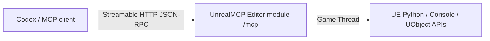

# In-editor Streamable HTTP architecture

## One server inside Unreal Editor

The `UnrealMCP` Editor module owns the MCP protocol server and serves the stateless Streamable HTTP endpoint directly from the Unreal Editor process. No child gateway process or external runtime is required. Clients connect to `http://127.0.0.1:18777/mcp` by default.

The module implements JSON-RPC framing, MCP `server/discover`, legacy `initialize`, `ping`, `tools/list`, `tools/call`, local capability search, async task state, and optional bearer authentication. GET returns HTTP 405 because the stateless server has no standalone SSE notification stream; request responses are returned directly from POST as `application/json`.

HTTP requests are dispatched to the Game Thread before the module touches Python, `GEngine`, `GEditor`, or UObjects. The listener binds only to localhost, validates browser origins, and does not stop listeners owned by other UE modules during shutdown.

## Protocol compatibility

The server supports the modern 2026-07-28 discovery handshake, including result envelopes and server identity metadata, plus legacy protocol versions from 2024-11-05 through 2025-11-25. Task lifecycle remains an action inside the single normal tool, so it does not depend on protocol-specific `tasks/*` methods.

## Distribution boundary

The Fab package contains one top-level `UnrealMCP` plugin with its descriptor, Source, Config, Content, Resources, license notices, and Editor binary. Node.js exists only as an optional development test client and is never included in the package.
