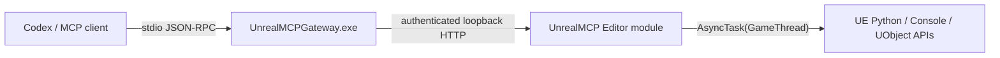

# Native plugin architecture

## Why there are two native processes

A stdio MCP server must be a child process launched by the MCP client. An Unreal Editor module is a DLL loaded into an independently launched editor, so it cannot own the client's stdin/stdout. The plugin therefore ships a small native console executable beside its Editor DLL. Both are part of the same installable plugin and neither requires an external runtime.

`UnrealMCPGateway.exe` implements JSON-RPC framing, MCP `server/discover`, legacy `initialize`, `ping`, `tools/list`, `tools/call`, local capability search, async task state, bearer headers, and WinHTTP communication. It writes protocol messages only to stdout and diagnostics only to stderr.

The Editor module owns all engine-dependent work. Its HTTP handler copies request data and schedules execution onto the Game Thread before touching Python, `GEngine`, `GEditor`, or UObjects. The server binds only to localhost and does not stop listeners owned by other UE modules during shutdown.

## Protocol compatibility

The gateway supports the modern 2026-07-28 discovery handshake, including result envelopes and server identity metadata, plus legacy protocol versions from 2024-11-05 through 2025-11-25. Task lifecycle remains an action inside the single normal tool, so it does not depend on protocol-specific `tasks/*` methods.

## Distribution boundary

The Fab package contains one top-level `UnrealMCP` plugin with its descriptor, Source, Config, Content, Resources, license notices, Editor binary, and native gateway executable. Node.js exists only as an optional development test client and is never included in the package.
